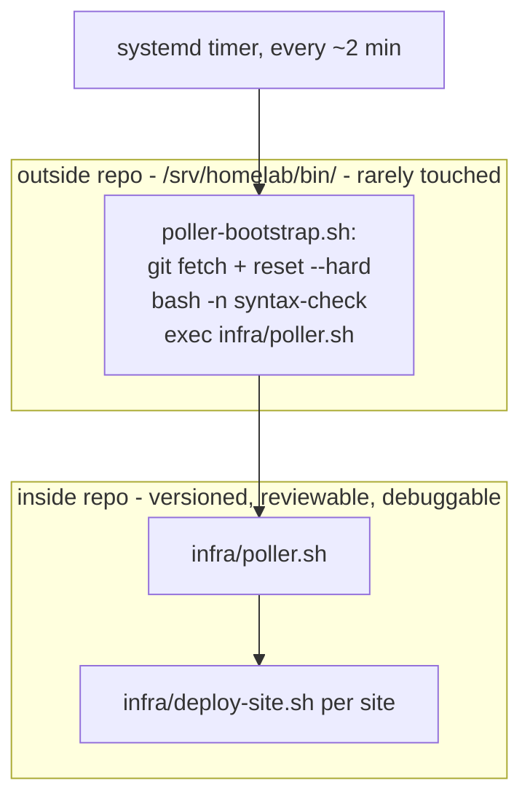

# `infra/` — deployment & monitoring, in-repo

This directory replaces the deploy/poller/register scripts that used to live only on the homelab
server (outside git, per [`../Server-Dev-chat.md`](../Server-Dev-chat.md)'s history). Bringing them
in-repo means both the Dev and Server agents (and you) can see, diff, and debug the actual pipeline
code — not just documentation describing it — and it lets `deploy-site.sh` write exact deploy
status that the [admin dashboard](../sites/personal/admin) can display.

```
infra/
  sites.json               # site registry (site -> domain/port/compose_dir/branch/poll_enabled)
  poller.sh                 # periodic entry point: loops sites.json, calls deploy-site.sh per site
  deploy-site.sh <site>      # docker compose up --build for one site; writes state/<site>.json
  register-site.sh          # adds/updates an entry in sites.json, prints the Caddy block to add
  lib/
    sites.py                 # tiny JSON-registry helper CLI used by the shell scripts
    write_status.py          # writes state/<site>.json without fragile shell-quoted JSON
  monitoring/
    check-health.sh          # curls each site's /health + /api/health, appends to state/health.jsonl
  caddy/
    Caddyfile                 # tracked for visibility; symlinked into place on the server (below)
  scripts/
    reload-caddy.sh            # validates the Caddyfile, then reloads Caddy
```

State (deploy status, health-check history, poller log) is written to `/srv/homelab/state`
(override with `STATE_DIR`), which `sites/personal/admin` bind-mounts read-only.

## How the poller works

1. A systemd timer fires roughly every 2 minutes.
2. It runs a tiny **outside-repo** stub, `poller-bootstrap.sh` (see below), which pulls the repo
   and hands off to `infra/poller.sh` inside it.
3. `poller.sh` takes an flock lock (so two cycles can never overlap), reads `sites.json`, and runs
   `deploy-site.sh <site>` for every `poll_enabled` site.
4. `deploy-site.sh` runs `docker compose --project-directory <compose_dir> --project-name <site> up
   -d --build` and always writes `/srv/homelab/state/<site>.json` — win or lose — with the commit
   SHA, timestamp, status, duration, and a tail of the build/compose output.

## The chicken-and-egg problem: updating the deploy script that deploys itself

If the poller's own logic lived *only* inside the repo it pulls, there'd be no safe way to fix a bug
in it — the very process applying your fix would be running the broken version. The fix is a
**two-layer split**:



- **`poller-bootstrap.sh`** stays outside the repo, on purpose, and stays tiny: pull the repo, then
  `exec` straight into `infra/poller.sh`. It's the one piece of this pipeline we deliberately do
  *not* version-control — it's what finds the repo in the first place, so it can't bootstrap itself.
- Because it's a **fresh process `exec` on every single timer tick**, it always runs whatever is on
  disk *right now*. There's no long-running process holding a stale in-memory copy of `poller.sh` or
  `deploy-site.sh`. Push a fix → the very next tick (≈2 min later) uses it, same as any other commit.
- Install it once on the server (not tracked here, since it lives outside the repo by design):

  ```bash
  # /srv/homelab/bin/poller-bootstrap.sh
  #!/usr/bin/env bash
  set -euo pipefail
  REPO_DIR=/srv/homelab/repos/homelab-app

  cd "$REPO_DIR"
  git fetch --quiet origin main
  git reset --hard origin/main

  exec bash "$REPO_DIR/infra/poller.sh"
  ```

  Point the existing `homelab-poller.timer`/service at this file instead of whatever it currently
  invokes.

### Safety nets

1. **`flock`** in both `poller.sh` and `monitoring/check-health.sh` — refuses to start a new run
   while a previous one is still in flight, so a `git reset --hard` mid-cycle can never yank the
   working tree out from under a script that's still executing.
2. **`bash -n` syntax gate** — `poller.sh` syntax-checks `deploy-site.sh` before running it. A typo
   pushed to `main` aborts loudly for that one cycle (logged to `state/poller.log`, visible in the
   admin dashboard) instead of half-executing garbage or silently wedging every future cycle.
3. **Manual rollback runbook** — the human escape hatch for the rare case a bad `infra/` change
   breaks the pipeline for *every* site, not just one:

   ```bash
   ssh homelab
   cd /srv/homelab/repos/homelab-app
   git log --oneline -- infra/
   git checkout <last-good-sha> -- infra/
   bash infra/deploy-site.sh <site>   # redeploy by hand while the fix lands on main
   ```

4. Because a broken `infra/` push has a bigger blast radius than a broken `sites/<name>/` push (it
   can stall deploys for *every* site), give infra changes a quick `bash -n infra/*.sh` locally (or
   a second look) before pushing to `main` — called out again in `Server-Dev-chat.md`.

### Running scripts directly, for debugging

`deploy-site.sh` and `register-site.sh` are written to be safe to invoke by hand over SSH — the
exact same code path the poller uses, so manual debugging never drifts from what automation runs:

```bash
bash /srv/homelab/repos/homelab-app/infra/deploy-site.sh personal
bash /srv/homelab/repos/homelab-app/infra/register-site.sh newsite newsite.example.com 3002
python3 /srv/homelab/repos/homelab-app/infra/lib/sites.py list-enabled
```

## Caddy

`infra/caddy/Caddyfile` is tracked here for visibility/diffability. On the server,
`/srv/homelab/caddy/Caddyfile` should be a **symlink** to this file, so editing it in the repo *is*
editing the live config:

```bash
ln -sf /srv/homelab/repos/homelab-app/infra/caddy/Caddyfile /srv/homelab/caddy/Caddyfile
```

Caddy doesn't hot-watch the file, so a change still needs `bash infra/scripts/reload-caddy.sh`
(validates first — a bad Caddyfile would otherwise take down every site behind it, not just one).
This is deliberately a **manual** step for now, not something the poller triggers automatically on
every Caddyfile change — see the plan's "out of scope" notes.

## Monitoring

`infra/monitoring/check-health.sh` is meant to run on its own short-interval systemd timer,
independent of the deploy poller (a site can go unhealthy without a new deploy happening). It reads
`port` for each `poll_enabled` site from `sites.json`, curls `/health` and `/api/health` on
`127.0.0.1:<port>`, and appends one JSON line per check to `state/health.jsonl` (capped at the last
2000 lines). `sites/personal/admin`'s `GET /api/health-history` reads this file.

## Migrating from the current server-only scripts

These files are meant to **replace** the equivalents that currently live only on the server
(`/srv/homelab/deploy/deploy-site.sh`, `register-site.sh`, and the poller's own script — see
`SETUP.md` and `Server-Dev-chat.md` for their current invocation). They implement the same
documented contract (`--project-directory <compose_dir> --project-name <site>`, the `sites.json`
schema already in use, `poll_enabled`), but were written from that documentation rather than the
original source, since the Dev side of this repo has never had access to the server-only copies.
**The Server agent should diff behavior against what's actually running today and reconcile any
gaps** before cutting the old scripts over — see the migration checklist posted to
`Server-Dev-chat.md`.
